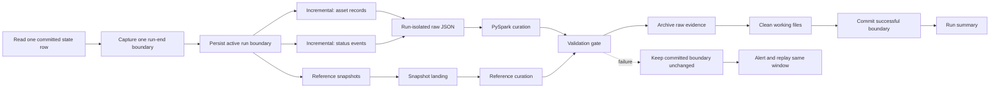

# Microsoft Fabric API Ingestion Operating Case Study

This case study presents an operating design I authored for scheduled
construction-data ingestion in Microsoft Fabric. It preserves the real
workflow, control decisions, review findings, and recovery logic while
replacing every source-specific name and omitting all production identifiers.

The runnable files elsewhere in this repository use generated sample records.
The orchestration described here comes from the operating pattern I designed
and documented; only its public identifiers and example records are synthetic.

## Public Boundary

The following labels exist only for this portfolio case study. They are not
aliases that can be used to infer a production value.

| Design role | Synthetic public label |
| --- | --- |
| Portfolio scope | `portfolio_demo` |
| Incremental entity stream | `asset_records` |
| Incremental event stream | `status_events` |
| Supporting reference snapshots | `catalog`, `project_register`, `issue_register` |
| Pipeline state table | `control.pipeline_state` |
| Curated entity table | `silver.asset_record` |
| Curated event table | `silver.status_event` |
| Working raw path | `Files/portfolio_demo/runs/{run_id}/{dataset}/page_{n}.json` |
| Archive path | `Files/portfolio_demo/archive/{dataset}/{run_id}/` |

No live URL, organization name, source product name, project identifier,
tenant, workspace, lakehouse, warehouse, connection, internal artifact name,
production table, source field map, storage path, credential, source record,
screenshot, exported definition, or run history is included.

## What the Design Demonstrates

- Microsoft Fabric pipeline orchestration across incremental and snapshot loads
- one frozen extraction window reused by every page in a run
- explicit pagination state and terminal handling
- parallel extraction branches with one final success dependency
- OneLake-style raw JSON landing and archive-before-cleanup lifecycle
- PySpark flattening, typing, deduplication, and Delta publication
- failure-safe state promotion and deterministic replay
- structural validation, quality gates, and operational hardening

## Architecture



The data plane extracts, lands, transforms, and publishes records. The control
plane owns the extraction window, page state, dependencies, validation,
archival order, committed boundary, notifications, and recovery.

## Workload Model

| Workload | Load mode | Extraction behavior | Publication behavior |
| --- | --- | --- | --- |
| `asset_records` | Incremental | Fixed time window plus page pointer | Key-based replacement into curated Delta |
| `status_events` | Incremental | Fixed time window plus page pointer | Key-based replacement into curated Delta |
| `catalog` | Snapshot | Full reference response | Replace the current reference view |
| `project_register` | Snapshot | Full reference response | Replace the current reference view |
| `issue_register` | Snapshot | Full reference response | Replace the current reference view |

The incremental streams carry operational change. The snapshots supply
reporting context. They can extract in parallel, but every required output must
reach the final success gate before the pipeline commits its new boundary.

## State Contract

The public control table is:

```text
control.pipeline_state
  pipeline_key
  last_committed_ms
  active_window_end_ms
  updated_at
```

The lookup must filter by one configured `pipeline_key` and return exactly one
row. A missing or duplicate row is a control failure, not a default-value case.

For each scheduled run:

```text
window_start = last_committed_ms
window_end   = current_utc_time_captured_once
```

`window_end` is captured once before extraction. It does not change between
datasets or pages. The run records it as `active_window_end_ms`, but it does
not promote it to `last_committed_ms` until the entire required workflow has
succeeded.

This creates a precise retry contract:

```text
success -> last_committed_ms = active_window_end_ms
failure -> last_committed_ms remains unchanged
retry   -> request the same uncommitted interval again
```

The design must also document whether the source treats the lower and upper
timestamps as inclusive or exclusive. That decision belongs in the interface
contract because it determines whether boundary events can be skipped or
repeated.

## End-to-End Run Sequence

1. Read the state row for the configured pipeline key.
2. Fail if the lookup does not return exactly one row.
3. Capture the run-end epoch once.
4. Persist it as the active, uncommitted boundary.
5. Start the incremental streams and required reference snapshots.
6. Paginate each incremental stream with the same frozen window.
7. Land every page as raw JSON in the current run folder.
8. Curate the incremental payloads with PySpark.
9. Curate or replace the supporting snapshots.
10. Record extraction and transformation quality metrics.
11. Block publication if a required quality gate fails.
12. Archive the successful run's raw evidence.
13. Delete only that run's known working files.
14. Promote the active boundary to the committed boundary.
15. Send a run summary containing status, window, counts, and duration.

## Pagination State Machine

Each incremental branch owns its page state. It starts from the interface's
documented first-page value and exits only on the documented terminal signal.

```text
page = first_page

while page is not terminal:
    response = request_page(
        dataset=dataset,
        window_start=window_start,
        window_end=window_end,
        page=page,
        page_size=configured_page_size
    )

    assert response belongs to the requested page
    write_raw_page(run_id, dataset, page, response.items)
    record_page_metrics(run_id, dataset, page, response)
    page = normalize_terminal_pointer(response.next_page)
```

Important controls:

- initialize both the current pointer and next pointer deliberately
- normalize a missing or null next pointer to the documented terminal value
- throttle or back off according to the API contract
- apply retry rules only to transient responses
- give every page a deterministic filename inside the current run
- persist enough metadata to prove which page ended the loop
- detect repeated pointers so a malformed response cannot create an infinite
  loop
- compare response, raw-file, and curated counts before state promotion

### Request-Efficiency Finding

A metadata request followed by a separate payload request for the same page is
functional, but it doubles API traffic and creates a window in which the two
responses may differ. The hardened target is one request per page: use the same
response to read the next-page pointer and persist the payload.

## Run-Isolated Raw Lifecycle

The safe working pattern is:

```text
Files/portfolio_demo/runs/{run_id}/{dataset}/page_{n}.json
Files/portfolio_demo/archive/{dataset}/{run_id}/page_{n}.json
```

Run isolation prevents a retry from consuming pages left by an interrupted
execution. It also makes count reconciliation and targeted cleanup possible.

Lifecycle order:

```text
write working pages
    -> validate page set
    -> curate
    -> pass quality gates
    -> archive pages
    -> verify archive
    -> delete only the current run's working folder
```

Archive-before-delete is a deliberate operational control. A broad cleanup of
a shared dataset folder is not safe because it can remove another run's
evidence or mix stale pages into the next transformation.

## PySpark Curation Logic

The designed notebook pattern:

1. Read all raw JSON pages for the current run and dataset.
2. Flatten the required nested fields.
3. Cast identifiers, timestamps, categories, and numeric values explicitly.
4. Reject or quarantine rows that fail the public table contract.
5. Deduplicate the current batch by deterministic record key.
6. If the curated table does not exist, create it.
7. Otherwise, keep prior rows whose keys are absent from the current batch.
8. Union those unaffected rows with the deduplicated incoming batch.
9. Publish the resulting Delta table.
10. Record incoming, duplicate, rejected, retained, inserted, and replaced
    counts.

Equivalent public pseudocode:

```python
incoming = (
    read_current_run_pages()
    .transform(flatten_and_cast)
    .dropDuplicates(["record_key"])
)

if curated_table_exists():
    current = read_curated_table()
    unaffected = current.join(
        incoming.select("record_key"),
        on="record_key",
        how="left_anti",
    )
    publish_delta(unaffected.unionByName(incoming))
else:
    publish_delta(incoming)
```

This is an upsert-like replacement pattern: incoming keys replace prior
versions, while prior keys absent from the current batch remain. It does not
delete a source record merely because that key was absent from one incremental
response.

### Scale Hardening

The replacement pattern is easy to reason about, but rewriting a full curated
table becomes expensive as history grows. The scale target is an atomic Delta
`MERGE` keyed by the deterministic record identifier, with an explicit source
deletion policy rather than deletion by absence.

## Empty-Window Contract

A valid incremental window can contain zero records. Every incremental
notebook and branch must handle that case consistently:

- create a zero-row run metric
- do not treat an empty payload as a schema sample
- skip data publication safely when there is nothing to publish
- continue required reference, archive, and control steps
- alert only when zero rows violate an expected-volume rule

Conflicting behavior between notebooks—one completing and another terminating
the run—creates an avoidable operational ambiguity.

## Validation Gate

Before the committed boundary advances, record and evaluate:

| Control area | Evidence |
| --- | --- |
| Pagination | first page, last page, terminal signal, repeated-pointer check |
| Reconciliation | source items, raw files, raw rows, curated rows, rejected rows |
| Keys | null keys, duplicate keys, inserted keys, replaced keys |
| Relationships | orphaned references and required lookup coverage |
| Time | minimum and maximum event time inside the requested window |
| Categories | unexpected status or category values |
| Schema | missing required fields, new fields, incompatible types |
| Volume | unexpected zero-row or abnormal-count result |
| Freshness | curated output timestamp and expected reporting availability |
| Lifecycle | archive verified and working folder cleaned |

A quality failure follows the same whole-pipeline failure path as extraction or
transformation failure. It cannot be converted into a successful state commit.

## Failure and Recovery

The original safety principle is strong: if downstream work fails, the
committed boundary remains unchanged and the next execution requests the same
window. Key-based replacement makes that replay idempotent at row level.

The whole-pipeline recovery procedure is:

1. Keep the committed boundary unchanged.
2. Record the failed window, run ID, dataset, page, and first failed activity.
3. Preserve or quarantine the failed run's raw evidence.
4. Remove only the verified working folder for that run if cleanup is needed.
5. Resolve the extraction, schema, transformation, or quality cause.
6. Replay the same uncommitted window.
7. Compare page, raw, curated, rejected, and replaced counts.
8. Confirm archive creation and cleanup.
9. Allow the normal success gate to commit the boundary.

Never advance the boundary manually unless the missing interval has been
independently reconciled.

## Alert Contract

Failure handling belongs at pipeline scope. Attaching an alert only to the
final state-update activity misses failures that prevent control flow from ever
reaching that activity.

An actionable alert should contain synthetic or runtime-safe metadata:

- pipeline label and run ID
- first failed activity and normalized error message
- frozen window start and end
- dataset and page when relevant
- retry count and duration
- confirmation that the committed boundary did not advance
- link to the secured monitoring record, not to a public artifact

The success summary should include the same window plus page, row, rejected,
inserted, replaced, archive, and duration metrics.

## Hardening Review

| Priority | Finding | Engineering response |
| --- | --- | --- |
| Critical | State lookup can select the wrong row | Filter by configured key and require exactly one result. |
| Critical | Shared raw folders can retain stale pages | Isolate files by run and validate the page set before curation. |
| Critical | Upstream failure may bypass a final-step alert | Add a whole-pipeline failure path. |
| High | Empty responses can behave differently by notebook | Define one zero-row contract and test it. |
| High | Embedded source scope makes promotion brittle | Move safe scope selection to secured runtime configuration. |
| High | Two calls per page waste quota and can drift | Use one response for metadata and payload. |
| High | Overlapping runs can compete for state | Serialize runs or lock state by pipeline key. |
| Medium | Full-table replacement does not scale indefinitely | Move to atomic Delta `MERGE`. |
| Medium | Naming and numeric types can become inconsistent | Publish and enforce one schema contract. |
| Medium | Counts exist only in transient logs | Persist run-level quality metrics for audit and trend analysis. |

## What Was Validated

The private operating guide was structurally reviewed across orchestration,
dependencies, variables, extraction expressions, pagination exits, raw-file
lifecycle, notebook behavior, state promotion, notifications, and recovery.
That review is evidence of design and control analysis.

It is not presented as evidence of a live public integration. This repository
does not claim to test:

- authentication against a live source
- a live Microsoft Fabric deployment or scheduled trigger
- production network, gateway, or concurrency behavior
- live credentials, rate limits, or source-side mutation
- downstream refresh of a private semantic model or dashboard

That distinction keeps the portfolio claim accurate: the operating design is
real and authored; the public data and identifiers are synthetic.

## Reviewer Takeaway

This case study demonstrates more than moving JSON into a table. It shows how I
reason about run state, changing source data, pagination completeness,
idempotent replay, file lifecycle, PySpark curation, Delta publication,
validation evidence, operational alerts, and the exact point at which an
incremental boundary becomes safe to commit.
